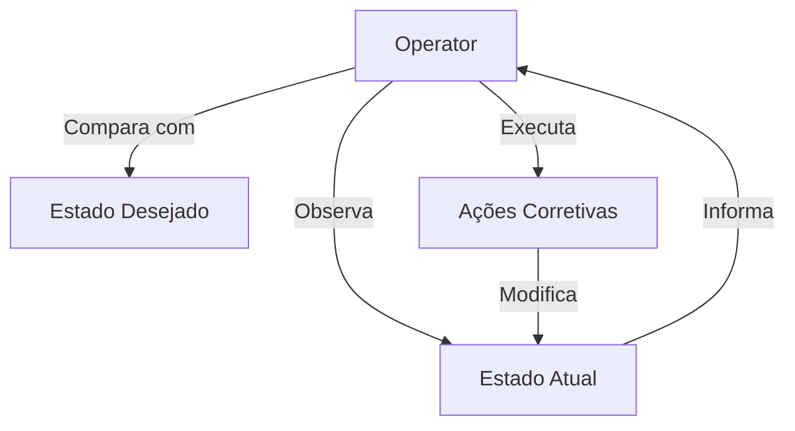

# Conceitos Básicos de Operators Kubernetes

## O que é um Operator?

Um Operator é um padrão de software que estende o Kubernetes para gerenciar aplicações e seus componentes. Ele atua como um loop de controle que:

1. Observa o estado atual do cluster
2. Compara com o estado desejado
3. Toma ações para alinhar os estados

## Componentes Principais

### 1. Custom Resource Definition (CRD)

CRD é uma extensão da API do Kubernetes que define novos tipos de recursos. Exemplo:

```yaml
apiVersion: apiextensions.k8s.io/v1
kind: CustomResourceDefinition
metadata:
  name: sampleapps.cloud104.com
spec:
  group: cloud104.com
  names:
    kind: SampleApp
    plural: sampleapps
  scope: Namespaced
  versions:
    - name: v1alpha1
      served: true
      storage: true
```

### 2. Custom Resource (CR)

CR é uma instância do seu CRD. Exemplo:

```yaml
apiVersion: apps.cloud104.com/v1alpha1
kind: SampleApp
metadata:
  name: sampleapp-example
spec:
  replicas: 3
  image: fmnapoli/teste-app:v2
  port: 5000
```

### 3. Controller

O controller é o código que implementa a lógica do operator:

- Monitora os recursos
- Processa mudanças
- Mantém o estado desejado

## O Loop de Reconciliação



## Casos de Uso Comuns

1. Automação de operações repetitivas
2. Gerenciamento de backups
3. Configuração de monitoramento
4. Deployment de aplicações complexas

## Próximos Passos

No próximo módulo, vamos configurar nosso ambiente de desenvolvimento para criar nosso primeiro operator.
