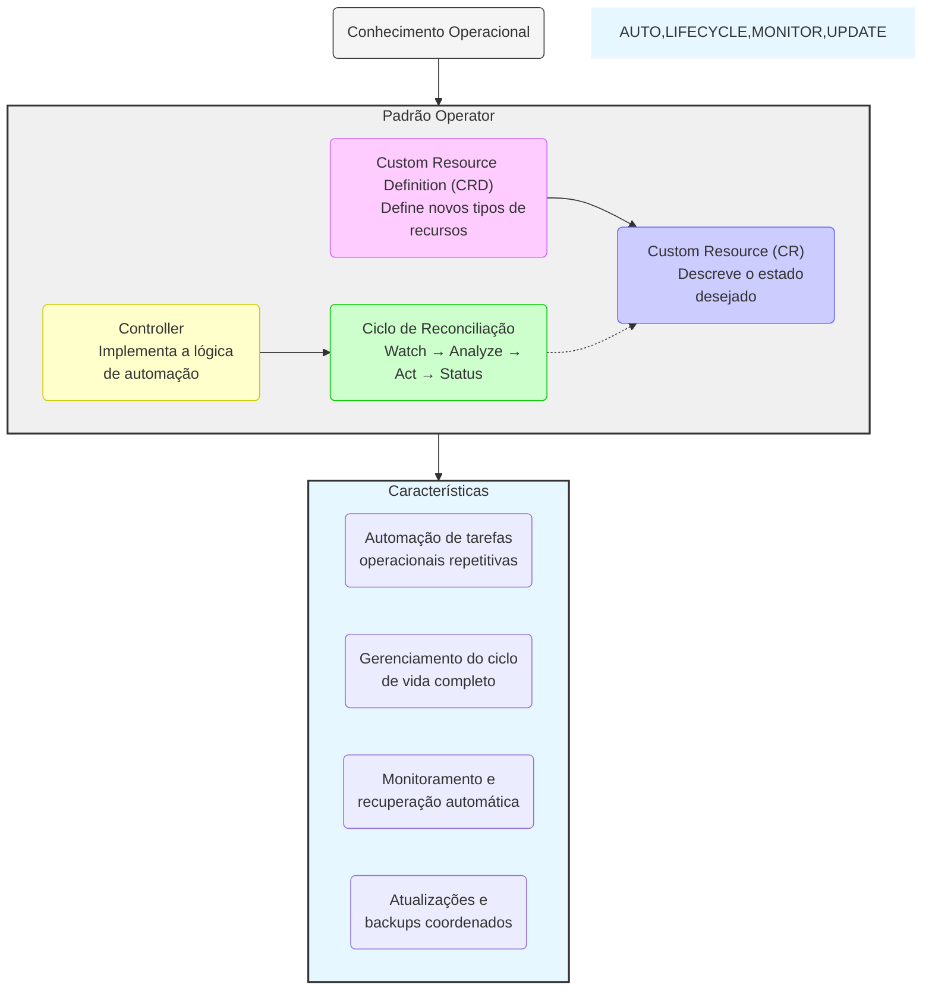
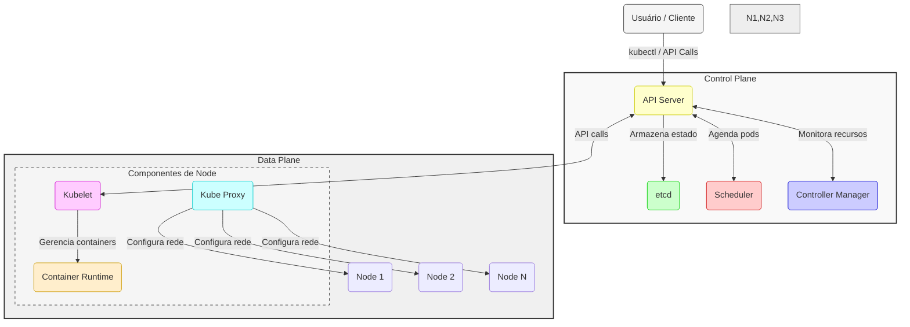
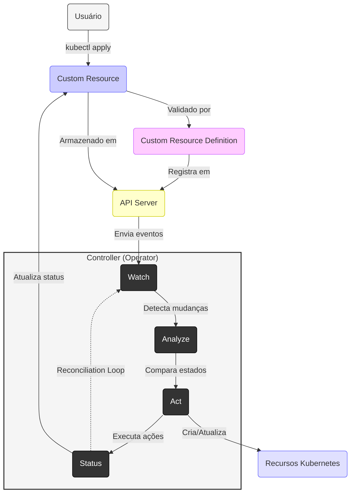
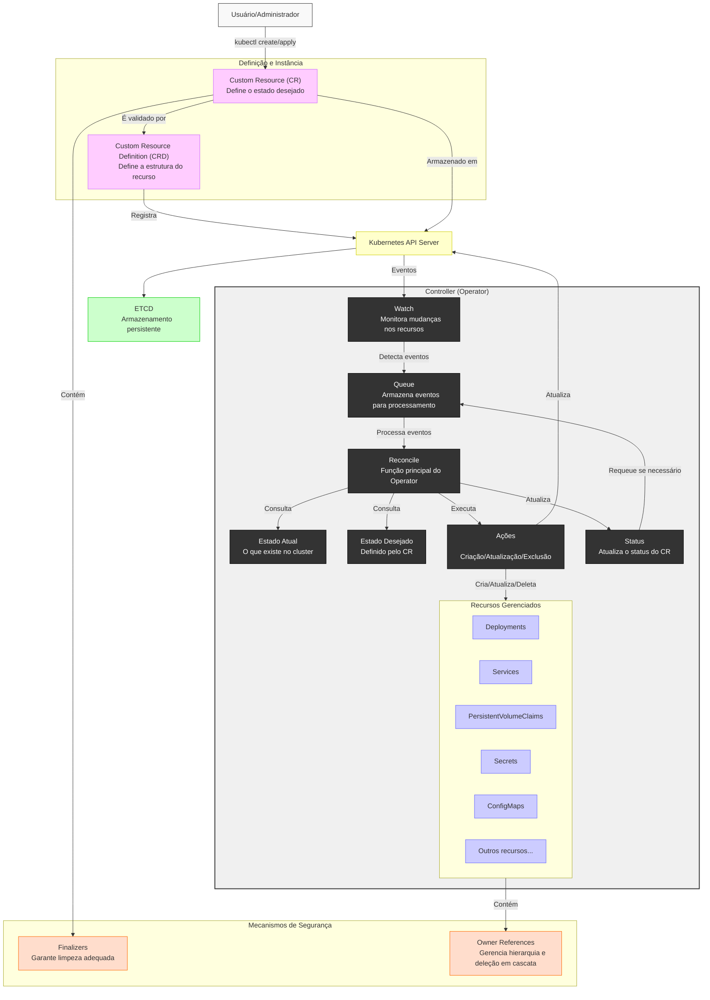
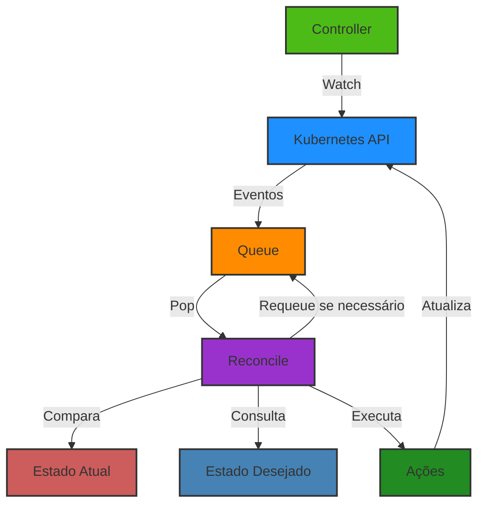

# Conceitos Básicos de Operators Kubernetes

## O que é um Operator?

Um Operator é um padrão de software que estende o Kubernetes para gerenciar aplicações e seus componentes. Ele encapsula o conhecimento operacional humano em código, automatizando tarefas complexas de gerenciamento de aplicações através de dois componentes fundamentais: Custom Resource Definitions (CRDs) e Controllers.

Os CRDs permitem definir novos tipos de recursos personalizados no Kubernetes, enquanto os Custom Resources (CRs) são instâncias desses recursos que representam o estado desejado da aplicação. O Controller observa esses recursos e executa ações para garantir que o estado atual do cluster corresponda ao estado desejado descrito nos CRs.



### Principais Características

- **Automação de tarefas operacionais repetitivas** através do ciclo de reconciliação do Controller
- **Gerenciamento do ciclo de vida completo da aplicação** usando CRs para descrever cada estado desejado
- **Monitoramento e recuperação automática** pelo Controller que constantemente compara e corrige discrepâncias
- **Atualizações e backups coordenados** definidos como operações declarativas em CRs

Este padrão permite que desenvolvedores e operadores codifiquem seu conhecimento de domínio específico sobre como gerenciar uma aplicação, convertendo operações manuais em processos automatizados que seguem as melhores práticas do Kubernetes.

### Arquitetura do Kubernetes



### Arquitetura de um Operator



### Arquitetura detalhada de um Operator



### 1. Custom Resource Definition (CRD)

CRD é uma extensão da API do Kubernetes que define novos tipos de recursos.

Exemplo de CRD para um banco de dados:

```yaml
apiVersion: apiextensions.k8s.io/v1
kind: CustomResourceDefinition
metadata:
  name: databases.cloud104.com
spec:
  group: cloud104.com
  names:
    kind: Database
    plural: databases
    singular: database
    shortNames:
      - db
  scope: Namespaced
  versions:
    - name: v1alpha1
      served: true
      storage: true
      schema:
        openAPIV3Schema:
          type: object
          properties:
            spec:
              type: object
              properties:
                version:
                  type: string
                storage:
                  type: string
                replicas:
                  type: integer
                  minimum: 1
```

### 2. Custom Resource (CR)

CR é uma instância do seu CRD que define o estado desejado.

Exemplo de CR usando o CRD anterior:

```yaml
apiVersion: cloud104.com/v1alpha1
kind: Database
metadata:
  name: prod-database
spec:
  version: "14.5"
  storage: "10Gi"
  replicas: 3
```

### 3. Controller

O controller implementa a lógica do operator através do padrão reconciliation loop:

1. **Watch**: Monitora mudanças nos recursos
2. **Analyze**: Compara estado atual vs. desejado
3. **Act**: Executa ações necessárias
4. **Status**: Atualiza o status do recurso

## O Loop de Reconciliação

O loop de reconciliação é o coração de qualquer Operator Kubernetes. Este processo contínuo garante que o estado atual do cluster esteja alinhado com o estado desejado definido pelo usuário.



### Componentes do Loop de Reconciliação

1. **Controller**: Componente central que implementa a lógica do operador.
2. **Watch**: Monitora continuamente o Kubernetes API Server por mudanças nos recursos.
3. **Queue**: Armazena eventos para processamento, com suporte a retry e rate limiting.
4. **Reconcile**: Função principal que implementa a lógica de negócio do operador.
5. **Estado Atual vs. Desejado**: O controller compara o que existe no cluster com o que deveria existir.
6. **Ações**: Operações executadas para alinhar os estados (criação, atualização, exclusão de recursos).
7. **Requeue**: Mecanismo para reagendar reconciliações periódicas ou em caso de erros.

### Exemplo de Função de Reconciliação

```go
func (r *DatabaseReconciler) Reconcile(ctx context.Context, req ctrl.Request) (ctrl.Result, error) {
    log := r.Log.WithValues("database", req.NamespacedName)
    
    // Buscar o recurso personalizado
    var database databasev1.Database
    if err := r.Get(ctx, req.NamespacedName, &database); err != nil {
        if errors.IsNotFound(err) {
            // O recurso foi deletado, nada a fazer
            return ctrl.Result{}, nil
        }
        log.Error(err, "Falha ao buscar Database")
        return ctrl.Result{}, err
    }
    
    // Lógica de reconciliação aqui...
    
    // Exemplo: Garantir que o Deployment existe
    deployment := &appsv1.Deployment{}
    err := r.Get(ctx, types.NamespacedName{Name: database.Name, Namespace: database.Namespace}, deployment)
    if err != nil && errors.IsNotFound(err) {
        // Criar deployment
        newDeployment := r.deploymentForDatabase(&database)
        if err = r.Create(ctx, newDeployment); err != nil {
            log.Error(err, "Falha ao criar Deployment")
            return ctrl.Result{}, err
        }
        return ctrl.Result{Requeue: true}, nil
    }
    
    // Atualizar status
    database.Status.Phase = "Running"
    if err := r.Status().Update(ctx, &database); err != nil {
        log.Error(err, "Falha ao atualizar status")
        return ctrl.Result{}, err
    }
    
    return ctrl.Result{RequeueAfter: time.Minute * 10}, nil
}
```

## Padrões de Design Comuns em Operators

### 1. Level Triggers vs Edge Triggers

#### Level Triggered (Gatilho por Nível)

- **Funcionamento**: O controller reconcilia constantemente, independente do evento que originou a reconciliação
- **Vantagens**:
  - Mais robusto contra falhas transitórias
  - Recupera-se automaticamente de estados inconsistentes
  - Melhor para sistemas que precisam de alta disponibilidade
- **Implementação**: Uso de `RequeueAfter` para reconciliação periódica

```go
return ctrl.Result{RequeueAfter: time.Minute * 5}, nil
```

#### Edge Triggered (Gatilho por Evento)

- **Funcionamento**: Reconcilia apenas quando ocorrem mudanças específicas nos recursos observados
- **Vantagens**:
  - Mais eficiente em termos de recursos computacionais
  - Reduz carga no API Server em clusters grandes
  - Menor latência para responder a mudanças
- **Implementação**: Filtros específicos no Watch para eventos relevantes

```go
func (r *DatabaseReconciler) SetupWithManager(mgr ctrl.Manager) error {
    return ctrl.NewControllerManagedBy(mgr).
        For(&databasev1.Database{}).
        Watches(
            &source.Kind{Type: &corev1.Secret{}},
            handler.EnqueueRequestsFromMapFunc(r.findDatabasesForSecret),
            builder.WithPredicates(predicate.ResourceVersionChangedPredicate{}),
        ).
        Complete(r)
}
```

### 2. Owner References

Owner References estabelecem relações hierárquicas entre recursos Kubernetes, permitindo a propagação automática de deleções (garbage collection).

```yaml
apiVersion: v1
kind: Pod
metadata:
  name: db-instance-pod
  ownerReferences:
    - apiVersion: cloud104.com/v1alpha1
      kind: Database
      name: prod-database
      uid: d9607e19-f88f-11e6-a518-42010a800195
      controller: true
      blockOwnerDeletion: true
```

#### Implementação em código

```go
// Definir ownerReference no pod
controllerRef := metav1.NewControllerRef(database, databasev1.GroupVersion.WithKind("Database"))
pod.OwnerReferences = []metav1.OwnerReference{*controllerRef}
```

#### Benefícios

- Deleção em cascata automática
- Rastreabilidade clara de recursos relacionados
- Prevenção de recursos órfãos no cluster

### 3. Finalizers

Finalizers são mecanismos que impedem a exclusão imediata de recursos até que condições específicas sejam atendidas, essenciais para limpeza adequada de recursos externos.

```yaml
apiVersion: cloud104.com/v1alpha1
kind: Database
metadata:
  name: prod-database
  finalizers:
    - cloud104.com/database-cleanup
spec:
  size: 10Gi
  engine: postgres
```

#### Ciclo de vida com Finalizers

1. **Adição do Finalizer**: Quando o recurso é criado, o operator adiciona o finalizer
2. **Solicitação de Exclusão**: Usuário aplica `kubectl delete`
3. **Bloqueio da Exclusão**: API Server marca o objeto com `deletionTimestamp` mas não o remove
4. **Execução da Limpeza**: Operator detecta `deletionTimestamp` e executa limpeza necessária
5. **Remoção do Finalizer**: Após limpeza bem-sucedida, operator remove o finalizer
6. **Exclusão Efetiva**: Sem finalizers, o objeto é finalmente removido do etcd

#### Implementação em código

```go
const databaseFinalizer = "cloud104.com/database-cleanup"

func (r *DatabaseReconciler) Reconcile(ctx context.Context, req ctrl.Request) (ctrl.Result, error) {
    // ... código anterior
    
    // Verificar se o objeto está sendo excluído
    if database.GetDeletionTimestamp() != nil {
        if containsString(database.GetFinalizers(), databaseFinalizer) {
            // Executar lógica de limpeza
            if err := r.cleanupExternalResources(&database); err != nil {
                return ctrl.Result{}, err
            }
            
            // Remover finalizer
            database.SetFinalizers(removeString(database.GetFinalizers(), databaseFinalizer))
            if err := r.Update(ctx, &database); err != nil {
                return ctrl.Result{}, err
            }
        }
        return ctrl.Result{}, nil
    }
    
    // Adicionar finalizer se não existir
    if !containsString(database.GetFinalizers(), databaseFinalizer) {
        database.SetFinalizers(append(database.GetFinalizers(), databaseFinalizer))
        if err := r.Update(ctx, &database); err != nil {
            return ctrl.Result{}, err
        }
    }
    
    // ... resto do código
}

func (r *DatabaseReconciler) cleanupExternalResources(db *databasev1.Database) error {
    // Lógica para limpar recursos externos (ex: instâncias RDS, volumes, DNS, etc)
    return nil
}
```

## Próximos Passos

No próximo módulo, vamos:

1. Configurar o ambiente de desenvolvimento
2. Criar um operator básico usando Kubebuilder
3. Implementar um loop de reconciliação simples
