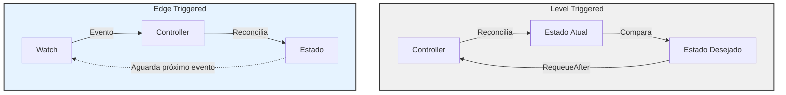
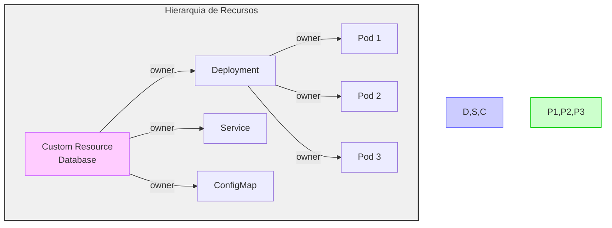
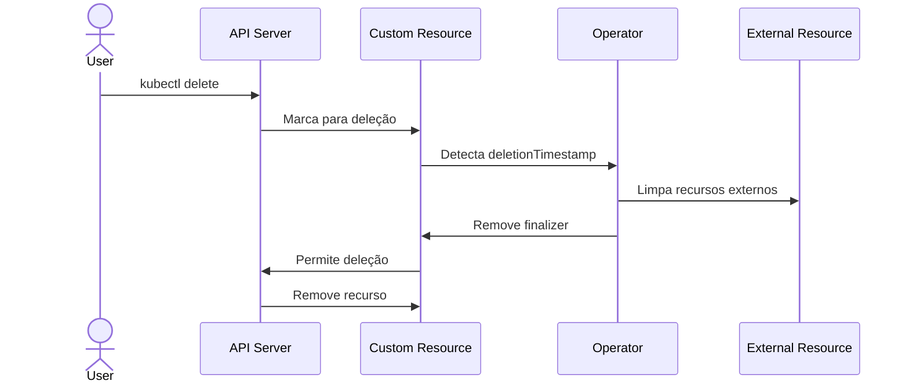
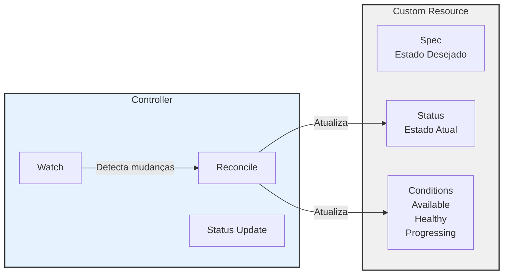
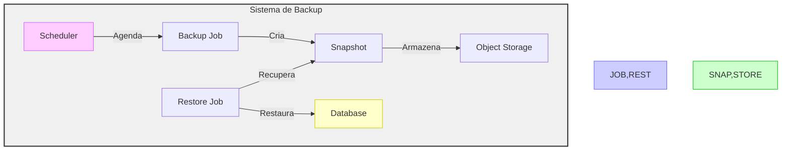
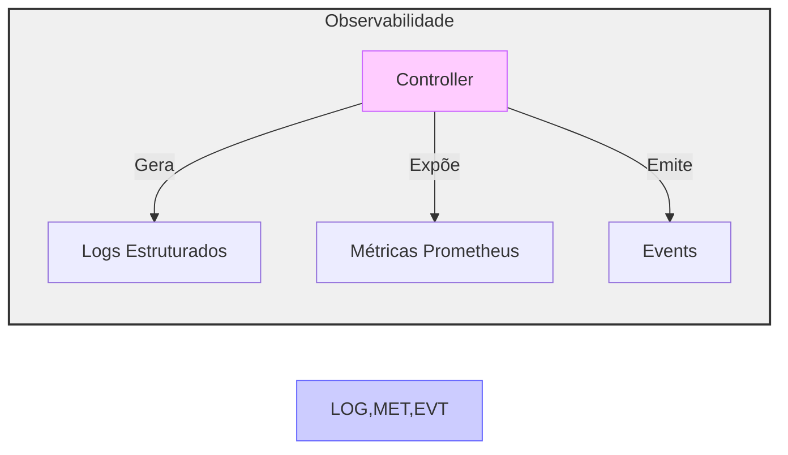
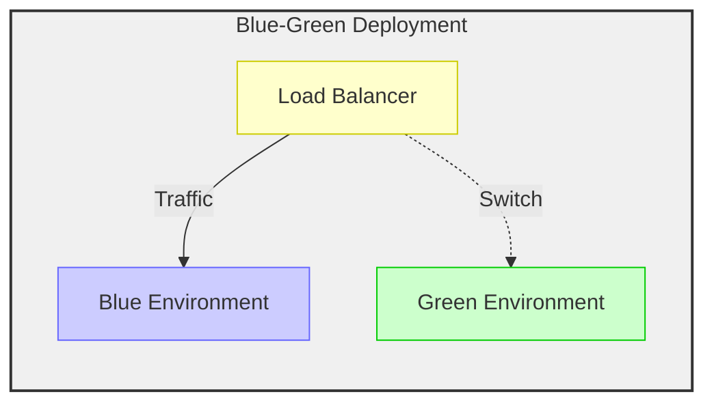
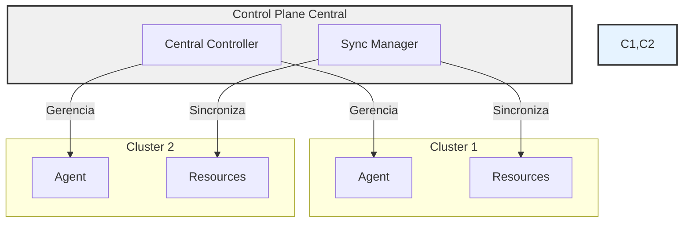

# Padrões Avançados de Design para Kubernetes Operators

## 1. Padrões de Reconciliação

### Level Triggers vs Edge Triggers



#### Level Triggered (Gatilho por Nível)

- **Funcionamento**: Reconciliação constante e periódica
- **Vantagens**:
  - Maior resiliência
  - Recuperação automática
  - Alta disponibilidade

```go
// Implementação Level Triggered
return ctrl.Result{RequeueAfter: time.Minute * 5}, nil
```

#### Edge Triggered (Gatilho por Evento)

- **Funcionamento**: Reconciliação baseada em eventos
- **Vantagens**:
  - Eficiência computacional
  - Menor latência
  - Menor carga no API Server

```go
// Implementação Edge Triggered
func (r *Reconciler) SetupWithManager(mgr ctrl.Manager) error {
    return ctrl.NewControllerManagedBy(mgr).
        For(&myappv1.MyApp{}).
        Watches(
            &source.Kind{Type: &corev1.Secret{}},
            handler.EnqueueRequestsFromMapFunc(r.findAppsForSecret),
        ).
        Complete(r)
}
```

## 2. Gerenciamento de Recursos

### Owner References



#### Implementação

```yaml
apiVersion: v1
kind: Pod
metadata:
  ownerReferences:
    - apiVersion: databases.example.com/v1
      kind: Database
      name: prod-db
      uid: d9607e19-f88f-11e6-a518-42010a800195
      controller: true
      blockOwnerDeletion: true
```

### Finalizers



#### Ciclo de Vida

1. Adição do Finalizer
2. Solicitação de Exclusão
3. Bloqueio da Exclusão
4. Execução da Limpeza
5. Remoção do Finalizer
6. Exclusão Efetiva

## 3. Status e Condições

### Status Subresource



#### Exemplo de Status

```yaml
status:
  phase: Provisioning
  observedGeneration: 12
  conditions:
    - type: Available
      status: "False"
      reason: Creating
      message: "Criando recursos"
```

## 4. Padrões de Backup e Recuperação



## 5. Monitoramento e Observabilidade

### Métricas e Logs



#### Exemplo de Métricas

```go
var (
    reconcileTotal = prometheus.NewCounterVec(
        prometheus.CounterOpts{
            Name: "controller_reconcile_total",
            Help: "Total de reconciliações",
        },
        []string{"result"},
    )
)
```

## 6. Deployment Strategies

### Blue-Green Deployment



## 7. Multi-cluster Management



## Boas Práticas

1. **Idempotência**
   - Operações devem ser seguras para repetição
   - Use CreateOrUpdate consistentemente
   - Verifique estados antes de modificar

2. **Segurança**
   - RBAC com princípio do menor privilégio
   - Secrets gerenciados adequadamente
   - Network Policies restritivas

3. **Escalabilidade**
   - Cache eficiente
   - Rate limiting
   - Backoff em retentativas

4. **Observabilidade**
   - Logs estruturados
   - Métricas relevantes
   - Events informativos

Estas práticas garantem Operators robustos, seguros e manteníveis.
