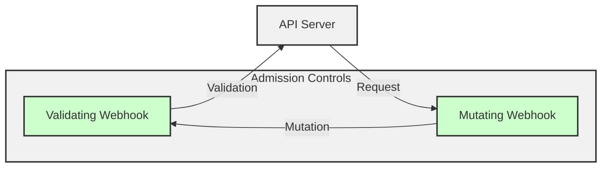
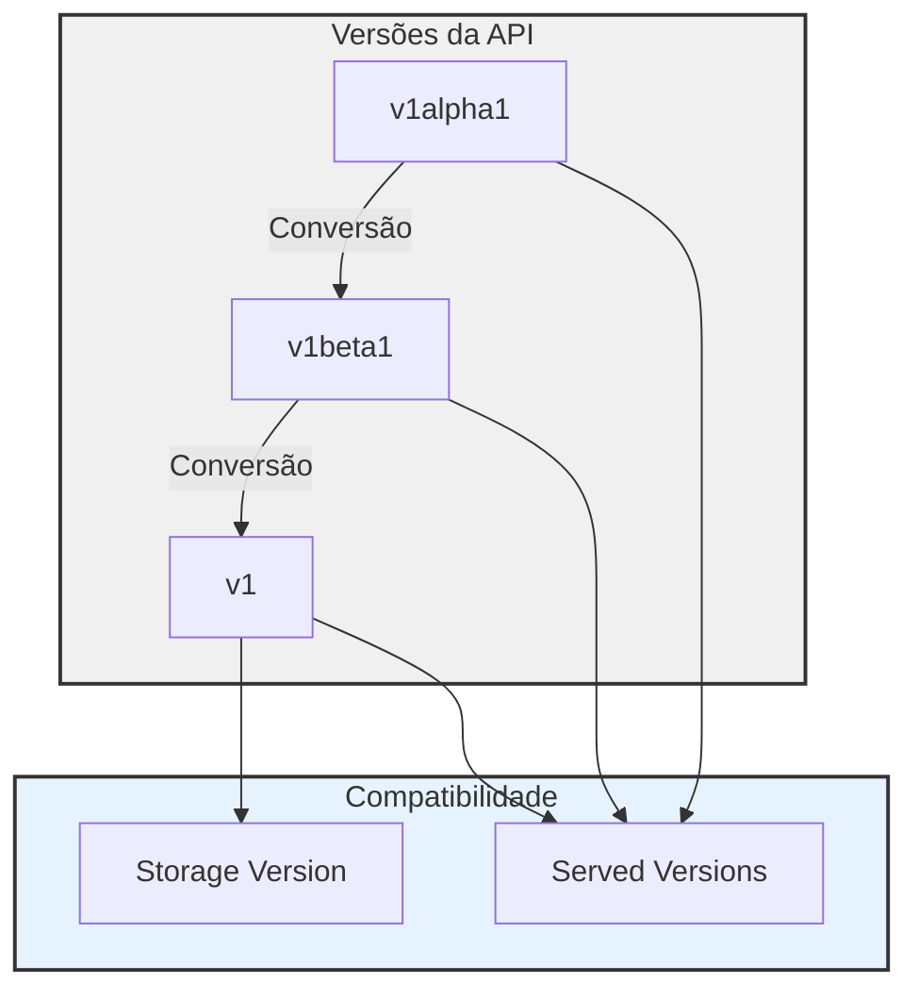
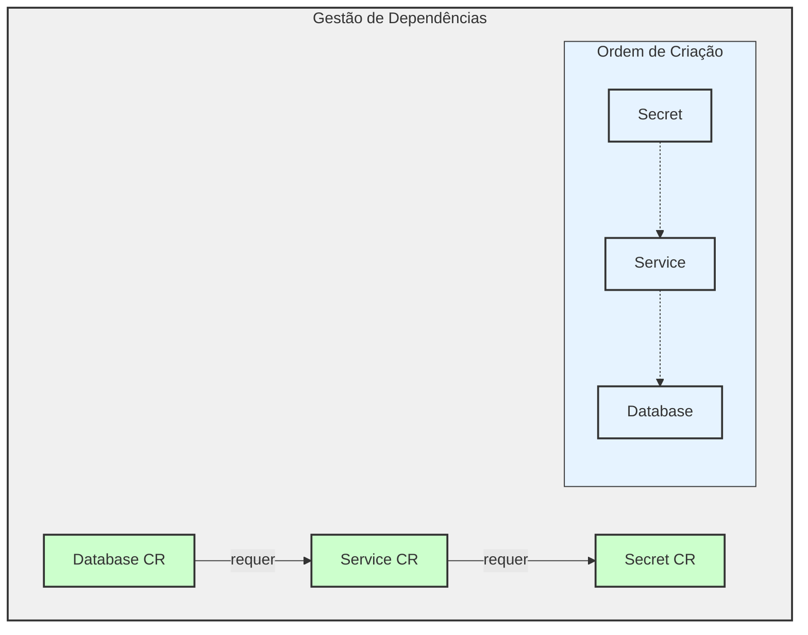
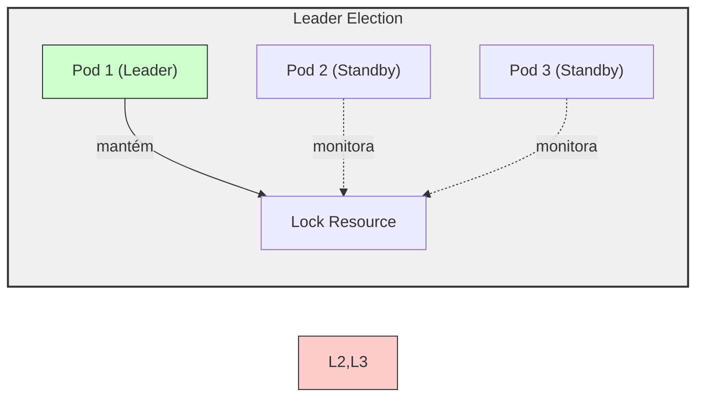
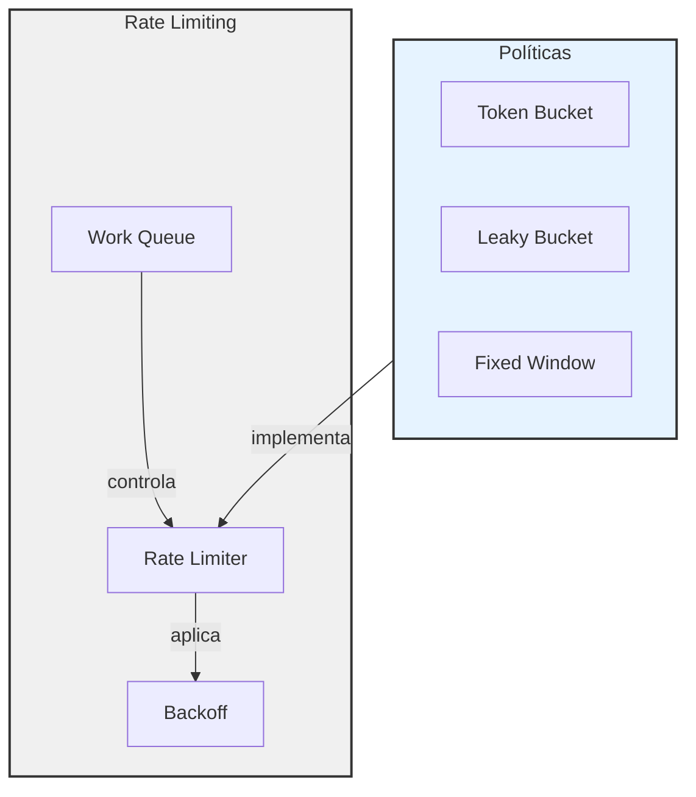
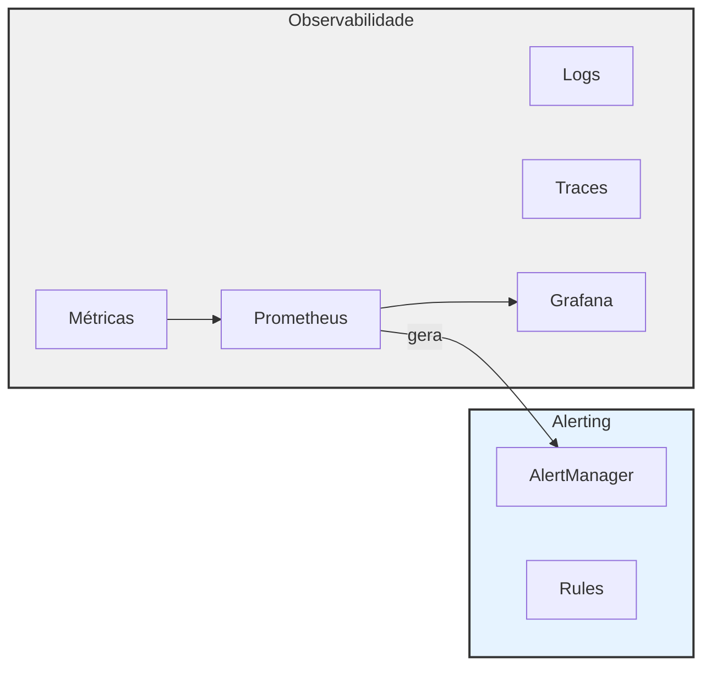
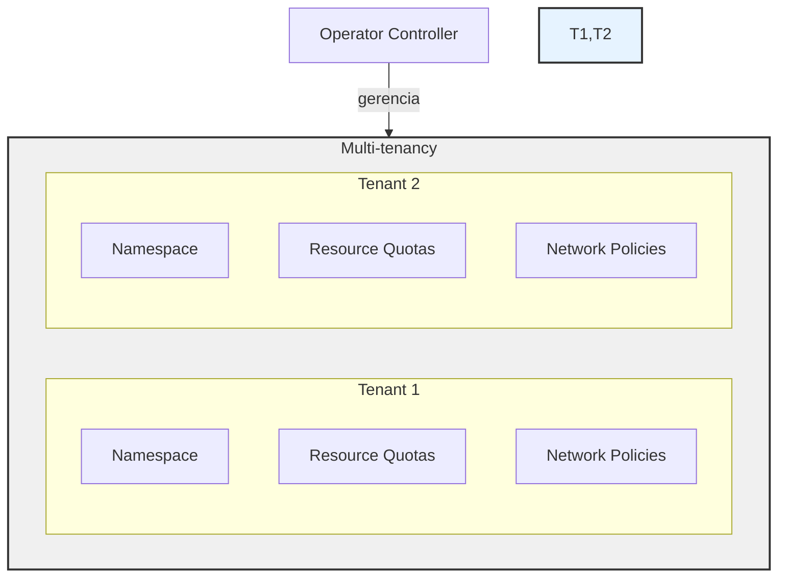
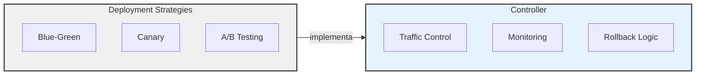
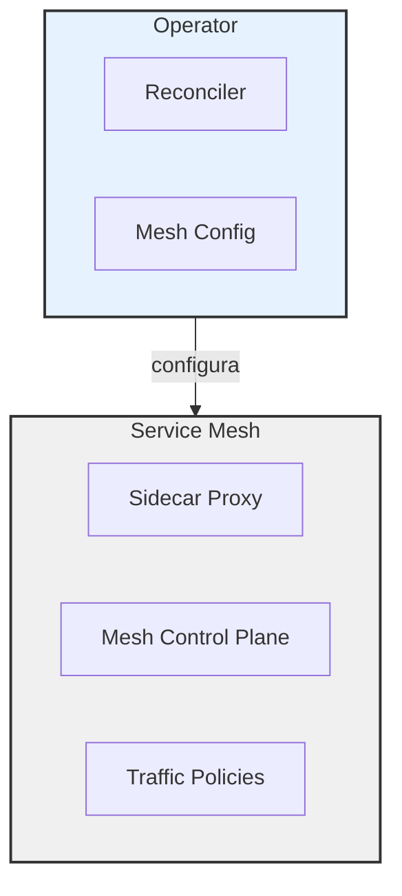
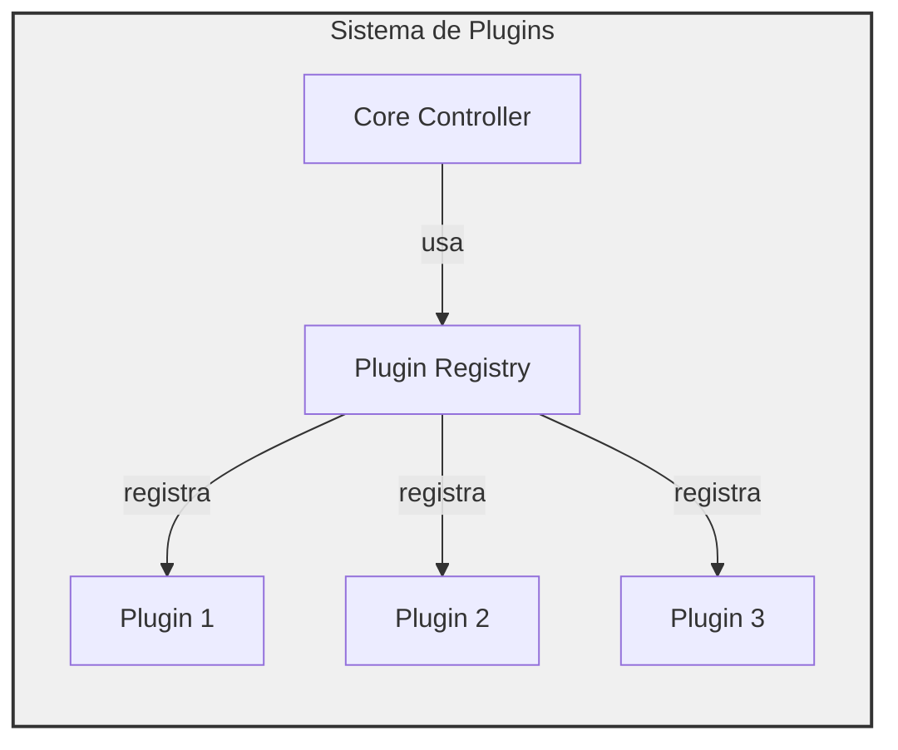

# Tópicos Avançados em Kubernetes Operators

## 1. Admission Controllers em Operators

Admission Controllers permitem validar e/ou modificar requisições ao Kubernetes antes que sejam persistidas.



### Implementação

```go
// Webhook de Validação
func (v *Validator) Handle(ctx context.Context, req admission.Request) admission.Response {
    obj := &myappv1.MyApp{}
    if err := v.decoder.Decode(req, obj); err != nil {
        return admission.Errored(http.StatusBadRequest, err)
    }
    
    // Lógica de validação
    if obj.Spec.Replicas < 1 {
        return admission.Denied("replicas must be >= 1")
    }
    
    return admission.Allowed("")
}
```

## 2. Padrões de Migração de Versão

### Estratégias de Conversão



### Exemplo de Webhook de Conversão

```go
func (c *Converter) Convert(ctx context.Context, obj runtime.Object) (runtime.Object, error) {
    switch obj := obj.(type) {
    case *v1alpha1.MyApp:
        return convertV1alpha1ToV1beta1(obj), nil
    case *v1beta1.MyApp:
        return convertV1beta1ToV1(obj), nil
    default:
        return nil, fmt.Errorf("unsupported type")
    }
}
```

## 3. Gestão de Dependências



### Implementação de Dependências

```go
func (r *Reconciler) ensureDependencies(ctx context.Context, obj *myappv1.MyApp) error {
    // 1. Garantir Secret
    secret := &corev1.Secret{}
    if err := r.ensureSecret(ctx, obj, secret); err != nil {
        return fmt.Errorf("ensuring secret: %w", err)
    }
    
    // 2. Garantir Service
    svc := &corev1.Service{}
    if err := r.ensureService(ctx, obj, svc); err != nil {
        return fmt.Errorf("ensuring service: %w", err)
    }
    
    // 3. Configurar Database
    return nil
}
```

## 4. Alta Disponibilidade

### Leader Election



### Implementação

```go
func main() {
    mgr, err := ctrl.NewManager(ctrl.GetConfigOrDie(), ctrl.Options{
        LeaderElection:          true,
        LeaderElectionID:        "myapp-operator",
        LeaderElectionNamespace: "default",
    })
    // ...
}
```

## 5. Rate Limiting e Backoff

### Estratégias de Rate Limiting



### Implementação

```go
// Configuração de Rate Limiting
workqueue.NewRateLimitingQueue(workqueue.NewMaxOfRateLimiter(
    workqueue.NewItemExponentialFailureRateLimiter(5*time.Millisecond, 1000*time.Second),
    &workqueue.BucketRateLimiter{Limiter: rate.NewLimiter(rate.Limit(10), 100)},
))
```

## 6. Métricas e Monitoramento

### Arquitetura de Observabilidade



### Métricas Customizadas

```go
var (
    reconcileTotal = prometheus.NewCounterVec(
        prometheus.CounterOpts{
            Name: "myapp_reconcile_total",
            Help: "Total number of reconciliations per status",
        },
        []string{"status"},
    )
    
    reconcileDuration = prometheus.NewHistogramVec(
        prometheus.HistogramOpts{
            Name:    "myapp_reconcile_duration_seconds",
            Help:    "Time spent doing reconciliations",
            Buckets: prometheus.DefBuckets,
        },
        []string{"status"},
    )
)
```

## 7. Multi-tenancy

### Arquitetura Multi-tenant



### Implementação

```go
// Configuração por Tenant
type TenantConfig struct {
    ResourceQuota corev1.ResourceQuota
    NetworkPolicy networkingv1.NetworkPolicy
    ServiceAccount corev1.ServiceAccount
}

func (r *Reconciler) reconcileTenant(ctx context.Context, tenant string) error {
    config := r.getTenantConfig(tenant)
    
    // Criar/atualizar recursos do tenant
    if err := r.reconcileResourceQuota(ctx, tenant, config.ResourceQuota); err != nil {
        return err
    }
    // ...
}
```

## 8. Patterns de Deployment

### Estratégias Avançadas



## 9. Integração com Service Mesh

### Arquitetura com Service Mesh



## 10. Extensibilidade

### Arquitetura Plugável



### Implementação

```go
// Interface de Plugin
type Plugin interface {
    Name() string
    Init(ctx context.Context) error
    Reconcile(ctx context.Context, obj runtime.Object) error
}

// Registro de Plugins
type PluginRegistry struct {
    plugins map[string]Plugin
}

func (r *PluginRegistry) Register(p Plugin) {
    r.plugins[p.Name()] = p
}
```

## Conclusão

Estes tópicos avançados são cruciais para desenvolver Operators robustos e escaláveis. Cada aspecto requer consideração cuidadosa e implementação apropriada conforme os requisitos específicos do seu caso de uso.

Pontos-chave para lembrar:

1. Use Admission Controllers para validação e mutação
2. Planeje migrações de versão com antecedência
3. Gerencie dependências adequadamente
4. Implemente alta disponibilidade
5. Configure rate limiting e backoff
6. Monitore e colete métricas
7. Considere multi-tenancy desde o início
8. Use padrões de deployment apropriados
9. Integre com service mesh quando necessário
10. Mantenha o código extensível
