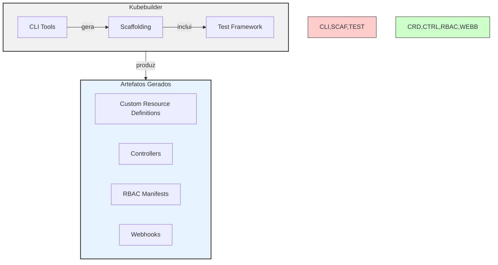
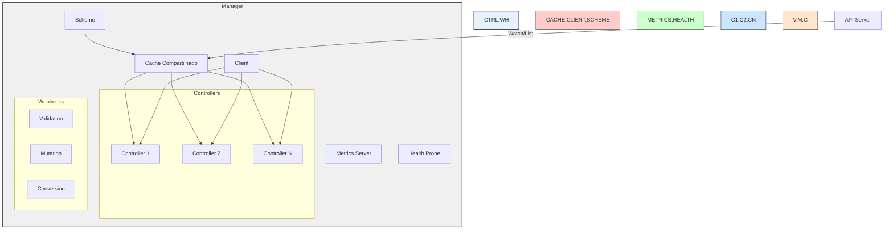
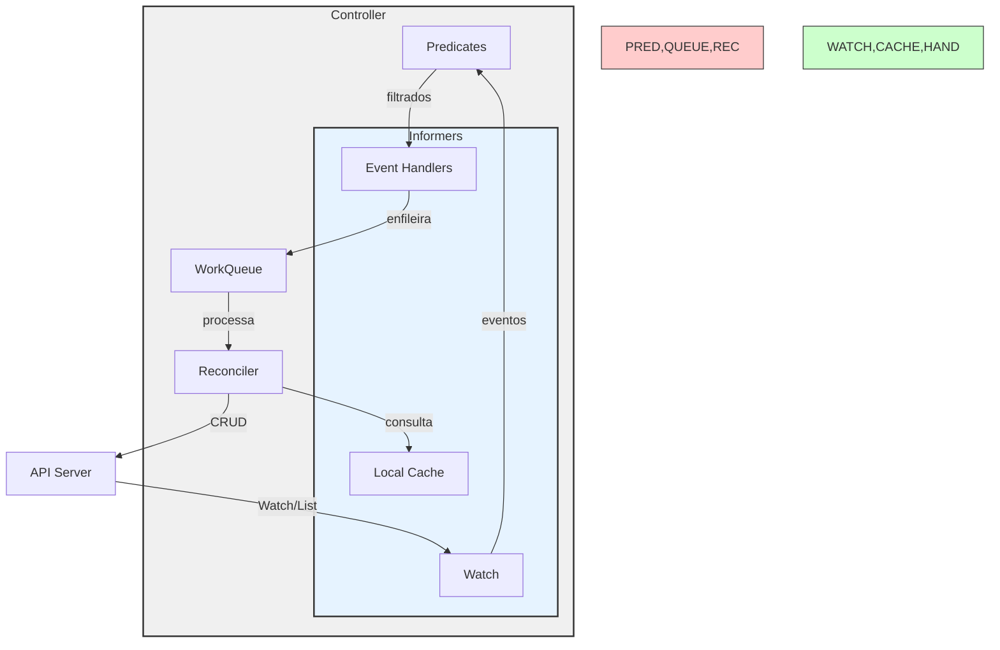
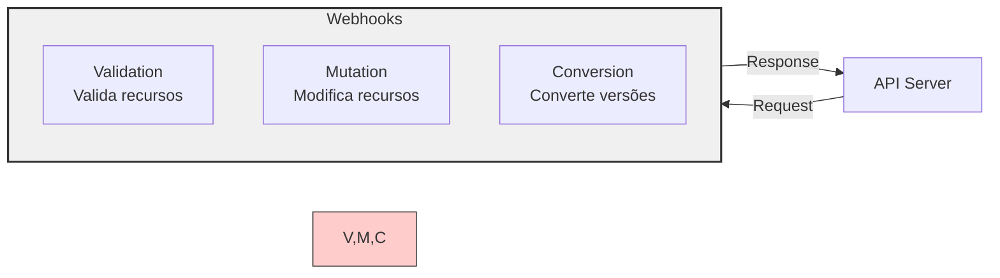

# Guia Completo do Kubebuilder

## O que é o Kubebuilder?

Kubebuilder é um framework para construir Kubernetes APIs e controllers usando CRDs (Custom Resource Definitions). Ele proporciona uma estrutura padronizada e ferramentas para desenvolver Operators de forma eficiente.



## Arquitetura do Manager

O Manager é o componente central em um projeto Kubebuilder. Ele gerencia controllers, webhooks e recursos compartilhados.



## Fluxo de um Controller

Diagrama mostrando como um controller processa recursos:



## Setup Básico

### 1. Inicialização do Projeto

```bash
# Inicializar novo projeto
kubebuilder init --domain my.domain.com --repo my.domain.com/myproject

# Criar API
kubebuilder create api --group apps --version v1alpha1 --kind MyApp
```

### 2. Estrutura do Projeto

```bash
.
├── api/                    # Definições de API (CRDs)
├── config/                 # Configurações e manifests
├── controllers/           # Implementação dos controllers
├── webhooks/             # Webhooks (opcional)
├── main.go               # Ponto de entrada
└── Makefile             # Automação de build/deploy
```

## Implementação do Controller

### 1. Definição da API (CRD)

```go
// api/v1alpha1/myapp_types.go
type MyAppSpec struct {
    // Campos da spec
    Replicas *int32 `json:"replicas,omitempty"`
}

type MyAppStatus struct {
    // Campos do status
    AvailableReplicas int32 `json:"availableReplicas"`
}
```

### 2. Reconciler

```go
// controllers/myapp_controller.go
func (r *MyAppReconciler) Reconcile(ctx context.Context, req ctrl.Request) (ctrl.Result, error) {
    log := r.Log.WithValues("myapp", req.NamespacedName)
    
    // Carregar o CR
    var myApp myappv1alpha1.MyApp
    if err := r.Get(ctx, req.NamespacedName, &myApp); err != nil {
        return ctrl.Result{}, client.IgnoreNotFound(err)
    }
    
    // Lógica de reconciliação
    return ctrl.Result{}, nil
}
```

## Uso de Informers

O Kubebuilder utiliza SharedInformers através do Manager para eficiência:

```go
// Setup do Controller com Informers
func (r *MyAppReconciler) SetupWithManager(mgr ctrl.Manager) error {
    return ctrl.NewControllerManagedBy(mgr).
        For(&myappv1alpha1.MyApp{}).                // Principal recurso
        Owns(&appsv1.Deployment{}).                 // Recursos owned
        Watches(                                    // Recursos adicionais
            &source.Kind{Type: &corev1.Secret{}},
            handler.EnqueueRequestsFromMapFunc(r.findObjectsForSecret),
        ).
        WithEventFilter(predicate.GenerationChangedPredicate{}). // Filtros
        Complete(r)
}
```

## Webhooks

### Tipos de Webhooks



### Implementação

```go
// Webhook de Validação
func (r *MyApp) ValidateCreate() error {
    // Lógica de validação
    return nil
}

// Webhook de Mutação
func (r *MyApp) Default() {
    // Lógica de valores default
}
```

## Testes

O Kubebuilder fornece um framework de testes integrado:

```go
// controllers/myapp_controller_test.go
func TestMyAppController(t *testing.T) {
    g := gomega.NewGomegaWithT(t)

    // Setup do ambiente de teste
    ctx := context.Background()
    mgr, err := ctrl.NewManager(cfg, ctrl.Options{Scheme: scheme.Scheme})
    g.Expect(err).NotTo(gomega.HaveOccurred())

    // Testes
    myApp := &myappv1alpha1.MyApp{
        ObjectMeta: metav1.ObjectMeta{
            Name:      "test-app",
            Namespace: "default",
        },
        Spec: myappv1alpha1.MyAppSpec{
            Replicas: pointer.Int32Ptr(3),
        },
    }

    // Criar recurso
    g.Expect(k8sClient.Create(ctx, myApp)).To(gomega.Succeed())

    // Verificar reconciliação
    // ...
}
```

## Boas Práticas

1. **Gerenciamento de Erros**
   - Use `Result{Requeue: true}` para retry
   - Implemente backoff adequado
   - Log estruturado para debugging

2. **Cache e Performance**
   - Use o cache compartilhado quando possível
   - Implemente filtros de eventos apropriados
   - Evite reconciliações desnecessárias

3. **Status Management**
   - Atualize status de forma consistente
   - Use conditions para refletir estados complexos
   - Mantenha observedGeneration atualizada

4. **RBAC**
   - Defina permissões mínimas necessárias
   - Use `+kubebuilder:rbac` markers
   - Valide permissões em testes

## Conclusão

O Kubebuilder proporciona uma estrutura robusta para desenvolver Operators Kubernetes, com:

- Geração automática de código e manifests
- Padrões estabelecidos de implementação
- Ferramentas de teste integradas
- Suporte a webhooks e validação
- Gerenciamento eficiente de recursos através de informers compartilhados
