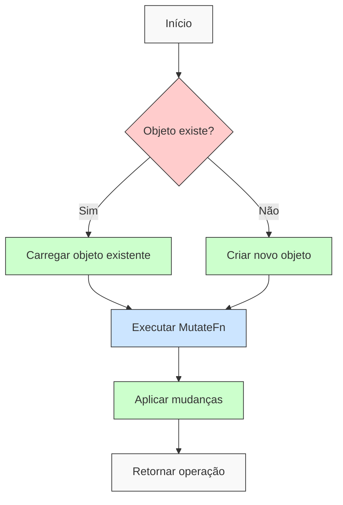
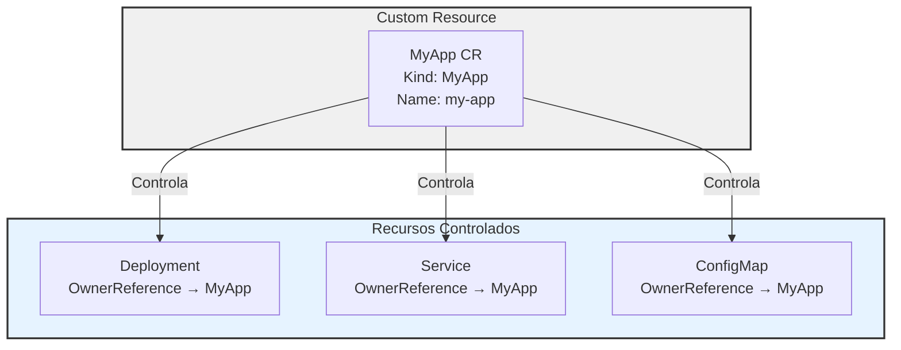
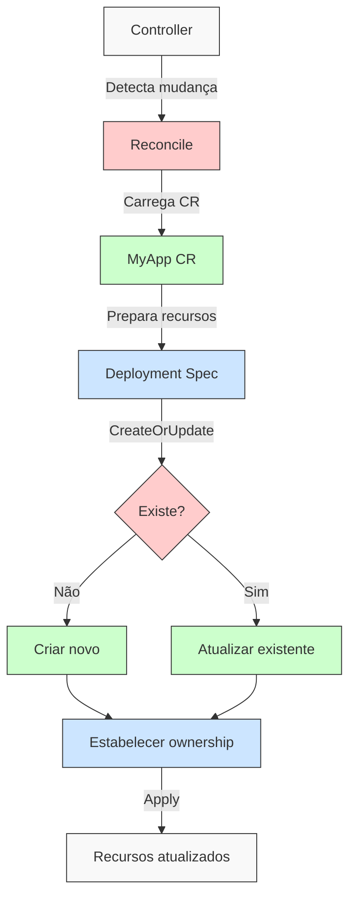

# Entendendo CreateOrUpdate e OwnerReferences no Kubernetes

## Padrão CreateOrUpdate

O padrão CreateOrUpdate é uma abstração comum em controllers Kubernetes que facilita a gestão de recursos, implementando a lógica de "criar ou atualizar" (upsert) de forma padronizada.

### Estrutura Básica

```go
op, err := ctrl.CreateOrUpdate(ctx, r.Client, deploy, func() error {
    r.specDeployment(app, deploy)
    return ctrl.SetControllerReference(app, deploy, r.Scheme)
})
```

### Fluxo de Execução



## Owner References

OwnerReferences estabelecem relações hierárquicas entre recursos no Kubernetes, permitindo o gerenciamento automático do ciclo de vida dos recursos.

### Estrutura das OwnerReferences



### Exemplo de OwnerReference

```yaml
metadata:
  ownerReferences:
  - apiVersion: myapp.example.com/v1
    kind: MyApp
    name: my-app-instance
    uid: d9607e19-f88f-11e6-a518-42010a800195
    controller: true
    blockOwnerDeletion: true
```

## Implementação em Controllers

### Exemplo Completo

```go
func (r *MyAppReconciler) Reconcile(ctx context.Context, req ctrl.Request) (ctrl.Result, error) {
    // Carregar o CR
    app := &myappv1.MyApp{}
    if err := r.Get(ctx, req.NamespacedName, app); err != nil {
        return ctrl.Result{}, client.IgnoreNotFound(err)
    }

    // Preparar o Deployment
    deploy := &appsv1.Deployment{
        ObjectMeta: metav1.ObjectMeta{
            Name:      app.Name,
            Namespace: app.Namespace,
        },
    }

    // Criar ou atualizar
    op, err := ctrl.CreateOrUpdate(ctx, r.Client, deploy, func() error {
        // Configurar o Deployment
        r.specDeployment(app, deploy)
        // Estabelecer ownership
        return ctrl.SetControllerReference(app, deploy, r.Scheme)
    })
    if err != nil {
        return ctrl.Result{}, err
    }

    log.Info("Deployment reconciled", "operation", op)
    return ctrl.Result{}, nil
}
```

### Fluxo de Reconciliação com OwnerReferences



## Benefícios

1. **Idempotência**
   - Operações podem ser repetidas com segurança
   - Mesmo resultado independente do número de execuções

2. **Atomicidade**
   - Mudanças são aplicadas de forma atômica
   - Evita estados parcialmente aplicados

3. **Consistência**
   - Garante que o estado desejado seja alcançado
   - Mantém a integridade das relações entre recursos

4. **Rastreabilidade**
   - OwnerReferences permitem rastrear relações
   - Facilita o debugging e a manutenção

5. **Ciclo de Vida Automatizado**
   - Recursos filhos são deletados quando o pai é removido
   - Garante limpeza adequada de recursos

## Boas Práticas

1. **Sempre use SetControllerReference**
   - Estabelece relação clara de propriedade
   - Permite garbage collection automático

2. **Implemente Idempotência**
   - Controllers devem lidar com reconciliações repetidas
   - Estado final deve ser consistente

3. **Trate Erros Adequadamente**
   - Implemente retentativas quando apropriado
   - Log adequado para debugging

4. **Documente Relacionamentos**
   - Mantenha clara a hierarquia de recursos
   - Documente o comportamento esperado

## Considerações de Desempenho

- CreateOrUpdate faz uma chamada GET antes de CREATE/UPDATE
- OwnerReferences adicionam overhead mínimo
- O garbage collection é assíncrono
- Considere o impacto em clusters grandes

O padrão CreateOrUpdate combinado com OwnerReferences forma a base para uma gestão robusta e confiável de recursos em controllers Kubernetes.
