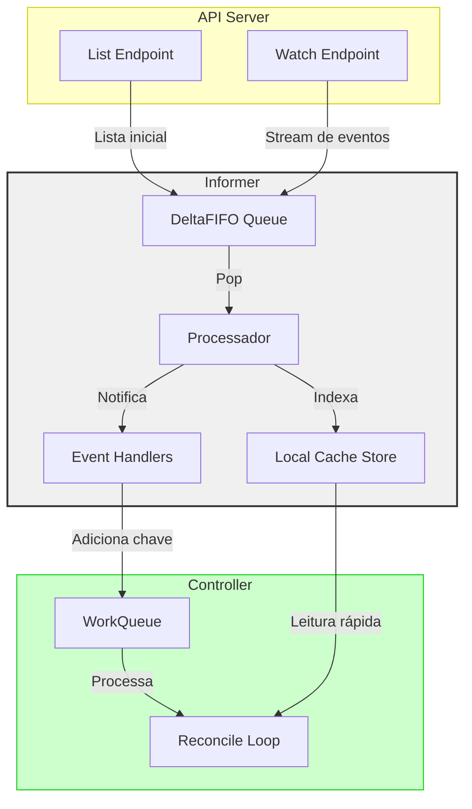
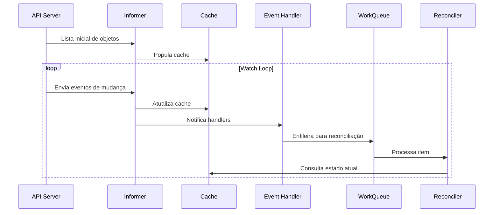
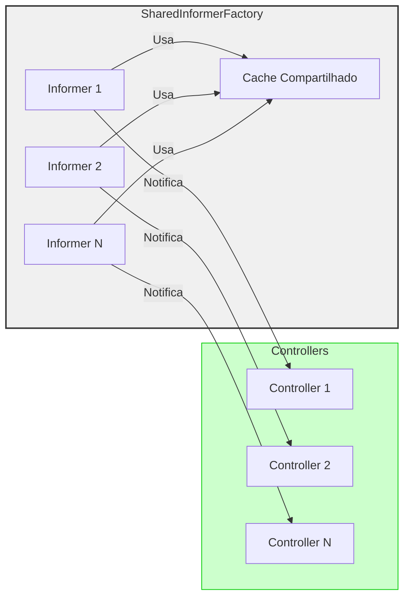

# Entendendo Informers no Kubernetes

## O que são Informers?

Informers são um padrão fundamental no Kubernetes que fornece um mecanismo eficiente para observar e reagir a mudanças nos recursos do cluster. Eles são especialmente importantes no desenvolvimento de Controllers e Operators.

## Arquitetura de Informers



## Componentes Principais

### 1. DeltaFIFO Queue

- Armazena eventos recebidos do API Server
- Mantém ordem FIFO para processamento
- Combina eventos duplicados
- Garante que nenhum evento seja perdido

### 2. Local Cache Store

- Mantém uma cópia local dos objetos
- Fornece acesso rápido sem consultar o API Server
- Suporta indexação para consultas eficientes
- Reduz carga no API Server

### 3. Event Handlers

- Reagem a eventos (Add/Update/Delete)
- Enfileiram trabalho para processamento
- Permitem lógica customizada por tipo de evento

## Fluxo de Informações



## Vantagens de Usar Informers

1. **Performance**
   - Reduz chamadas ao API Server
   - Cache local para consultas rápidas
   - Combinação de eventos duplicados

2. **Consistência**
   - Garante processamento ordenado
   - Mantém estado consistente
   - Previne perda de eventos

3. **Escalabilidade**
   - Eficiente em clusters grandes
   - Compartilhável entre controllers
   - Reduz carga no API Server

## Exemplo de Implementação

```go
// Criando um SharedInformerFactory
informerFactory := informers.NewSharedInformerFactory(client, time.Hour*24)

// Obtendo um informer específico
podInformer := informerFactory.Core().V1().Pods()

// Configurando handlers
podInformer.Informer().AddEventHandler(cache.ResourceEventHandlerFuncs{
    AddFunc: func(obj interface{}) {
        // Lógica para adição de objetos
        key, err := cache.MetaNamespaceKeyFunc(obj)
        if err == nil {
            queue.Add(key)
        }
    },
    UpdateFunc: func(old, new interface{}) {
        // Lógica para atualização de objetos
        key, err := cache.MetaNamespaceKeyFunc(new)
        if err == nil {
            queue.Add(key)
        }
    },
    DeleteFunc: func(obj interface{}) {
        // Lógica para deleção de objetos
        key, err := cache.DeletionHandlingMetaNamespaceKeyFunc(obj)
        if err == nil {
            queue.Add(key)
        }
    },
})
```

## Padrões de Uso

### SharedInformer Pattern



Este padrão permite que múltiplos controllers compartilhem o mesmo cache e infraestrutura de watch, reduzindo significativamente o consumo de recursos e a carga no API Server.

## Boas Práticas

1. **Use SharedInformers**
   - Compartilhe informers entre controllers quando possível
   - Evite criar múltiplos watches para o mesmo tipo de recurso

2. **Configure Resync Period**
   - Defina um período de resync apropriado
   - Considere a natureza dos seus recursos

3. **Implemente Rate Limiting**
   - Use workqueues com rate limiting
   - Evite sobrecarregar o cluster

4. **Valide Cache**
   - Verifique se o cache está sincronizado antes de processar
   - Implemente timeouts adequados

## Considerações de Desempenho

- O cache local reduz latência de leitura
- Eventos são processados de forma ordenada
- Rate limiting previne sobrecarga
- Resync period ajuda a manter consistência

Os Informers são uma parte crucial da arquitetura de controllers no Kubernetes, fornecendo um mecanismo eficiente e confiável para observar e reagir a mudanças no cluster.
