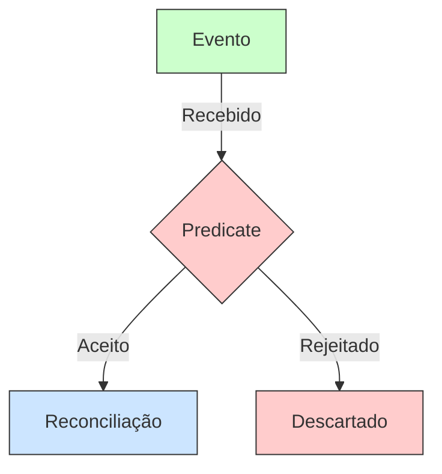
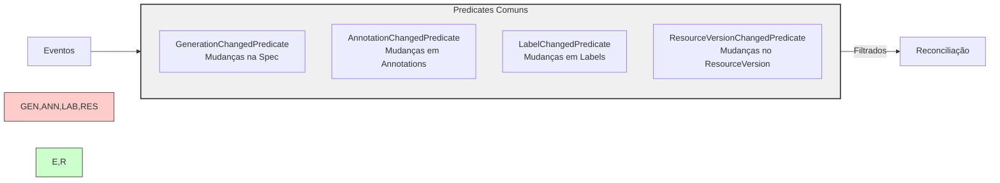
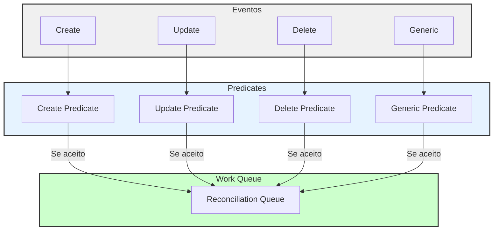

# Predicates no Kubebuilder

## O que são Predicates?

Predicates são filtros que determinam se um evento deve ou não disparar uma reconciliação. Eles ajudam a reduzir a carga no controller, evitando reconciliações desnecessárias.



## Tipos de Predicates



## Implementação de Predicates

### 1. Predicates Padrão

```go
// Usando predicates padrão
func (r *MyAppReconciler) SetupWithManager(mgr ctrl.Manager) error {
    return ctrl.NewControllerManagedBy(mgr).
        For(&myappv1.MyApp{}).
        WithEventFilter(predicate.GenerationChangedPredicate{}). // Apenas mudanças na spec
        WithEventFilter(predicate.ResourceVersionChangedPredicate{}). // Apenas mudanças reais
        Complete(r)
}
```

### 2. Predicates Customizados

```go
// Predicate customizado
type MyCustomPredicate struct {
    predicate.Funcs
}

func (MyCustomPredicate) Create(e event.CreateEvent) bool {
    // Lógica para eventos de criação
    return true
}

func (MyCustomPredicate) Update(e event.UpdateEvent) bool {
    // Lógica para eventos de atualização
    oldApp := e.ObjectOld.(*myappv1.MyApp)
    newApp := e.ObjectNew.(*myappv1.MyApp)
    
    // Exemplo: reconcilia apenas se replicas mudaram
    return oldApp.Spec.Replicas != newApp.Spec.Replicas
}

func (MyCustomPredicate) Delete(e event.DeleteEvent) bool {
    // Lógica para eventos de deleção
    return !e.DeleteStateUnknown
}
```

## Fluxo de Eventos com Predicates



## Combinando Predicates

### 1. And Predicate

Combina múltiplos predicates com operação AND lógica.

```go
// Todos os predicates devem retornar true
predicate.And(
    predicate.GenerationChangedPredicate{},
    MyCustomPredicate{},
)
```

### 2. Or Predicate

Combina múltiplos predicates com operação OR lógica.

```go
// Pelo menos um predicate deve retornar true
predicate.Or(
    predicate.GenerationChangedPredicate{},
    predicate.LabelChangedPredicate{},
)
```

## Casos de Uso Comuns

1. **Ignorar Status Updates**

```go
type IgnoreStatusUpdatePredicate struct {
    predicate.Funcs
}

func (IgnoreStatusUpdatePredicate) Update(e event.UpdateEvent) bool {
    // Compara apenas a spec, ignora mudanças no status
    oldApp := e.ObjectOld.(*myappv1.MyApp)
    newApp := e.ObjectNew.(*myappv1.MyApp)
    return !reflect.DeepEqual(oldApp.Spec, newApp.Spec)
}
```

2. **Filtrar por Label**

```go
type LabelFilterPredicate struct {
    predicate.Funcs
    Label string
}

func (p LabelFilterPredicate) Create(e event.CreateEvent) bool {
    // Reconcilia apenas se tiver o label específico
    return e.Object.GetLabels()[p.Label] != ""
}
```

3. **Filtrar por Annotation**

```go
type AnnotationFilterPredicate struct {
    predicate.Funcs
    Annotation string
}

func (p AnnotationFilterPredicate) Create(e event.CreateEvent) bool {
    return e.Object.GetAnnotations()[p.Annotation] != ""
}
```

## Benefícios do Uso de Predicates

1. **Performance**
   - Reduz carga no controller
   - Evita reconciliações desnecessárias
   - Otimiza uso de recursos

2. **Controle**
   - Filtragem granular de eventos
   - Lógica customizada de processamento
   - Melhor gerenciamento de recursos

3. **Manutenibilidade**
   - Código mais limpo e organizado
   - Separação clara de responsabilidades
   - Facilita testes e debugging

## Boas Práticas

1. **Use Predicates Padrão Quando Possível**
   - São bem testados e mantidos
   - Cobrem casos de uso comuns
   - Reduzem código boilerplate

2. **Combine Predicates de Forma Eficiente**
   - Use And/Or conforme necessidade
   - Evite lógica complexa demais
   - Mantenha predicates focados

3. **Teste Seus Predicates**
   - Implemente testes unitários
   - Verifique casos edge
   - Valide comportamento esperado

4. **Documente Comportamento**
   - Explique a lógica de filtragem
   - Documente casos especiais
   - Mantenha exemplos atualizados
